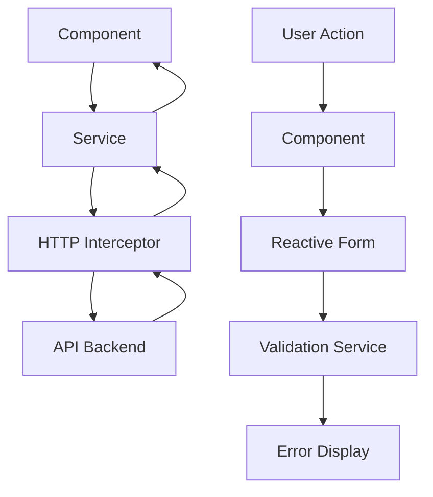
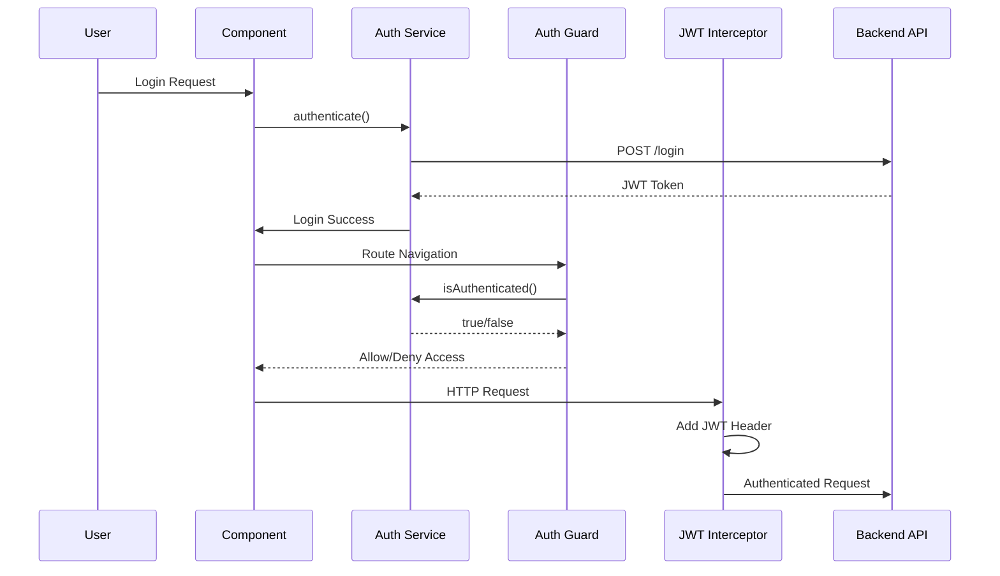

# 🏗️ Arquitetura do Sistema - Profile Watcher Web

## 📋 **Visão Geral da Arquitetura**

O Profile Watcher Web é uma aplicação Angular Single Page Application (SPA) construída com arquitetura modular, seguindo padrões de desenvolvimento modernos e boas práticas de estruturação de código.

### **Princípios Arquiteturais**

- **Separação de Responsabilidades**: Divisão clara entre camadas
- **Modularidade**: Organização em módulos funcionais
- **Reutilização**: Componentes e serviços compartilhados
- **Escalabilidade**: Estrutura preparada para crescimento
- **Manutenibilidade**: Código limpo e bem organizado

## 🏛️ **Estrutura de Camadas**

### **Camada de Apresentação (Presentation Layer)**

```
src/app/shared/layout/
├── header/              # Cabeçalho da aplicação
├── footer/              # Rodapé da aplicação
└── layout.component.*   # Container principal
```

### **Camada de Funcionalidades (Feature Layer)**

```
src/app/features/
├── profiles/            # Módulo de gerenciamento de perfis
│   ├── components/     # Componentes específicos
│   ├── profile-details/ # Detalhes do perfil
│   ├── profile-list/   # Listagem de perfis
│   └── profile.service.ts
└── user/               # Módulo de usuário
    ├── home/           # Página inicial
    ├── login/          # Autenticação
    ├── profile/        # Perfil do usuário
    └── register/       # Cadastro
```

### **Camada Core (Core Layer)**

```
src/app/core/
├── components/         # Componentes essenciais
├── guards/            # Guards de proteção
├── interceptors/      # Interceptors HTTP
├── models/           # Interfaces e tipos
└── services/         # Serviços principais
```

### **Camada Compartilhada (Shared Layer)**

```
src/app/shared/
├── components/        # Componentes reutilizáveis
│   ├── base-card/    # Componente base de card
│   ├── bootstrap-examples/ # Exemplos Bootstrap
│   └── menu/         # Componente de menu
└── layout/           # Layout principal
```

## 🔧 **Componentes Principais**

### **Sistema de Autenticação**

```typescript
// Guards
auth.guard.ts                    # Proteção de rotas
ensure-module-loaded-once.guard.ts # Prevenção de múltiplos carregamentos

// Interceptors
error.interceptor.ts             # Tratamento de erros
jwtToken.interceptor.ts          # Gerenciamento de tokens JWT

// Services
user.service.ts                  # Operações de usuário
login.service.ts                 # Lógica de autenticação
```

### **Sistema de Validação**

```typescript
// Components
control-error.component.*        # Exibição de erros
control-error-anchor.directive.ts # Âncora de erros
control-error.directive.ts       # Diretiva de erro
form-action.directive.ts         # Ações de formulário

// Services
validation.service.ts            # Lógica de validação
error-tailor.module.ts          # Módulo de tratamento de erros
```

### **Gerenciamento de Perfis**

```typescript
// Components
profile-list.component.*         # Listagem de perfis
profile-details.component.*      # Detalhes do perfil
profile-form.component.*         # Formulário de perfil

// Services
profile.service.ts               # Operações CRUD de perfis
```

## 🌊 **Fluxo de Dados**

### **Arquitetura de Dados**



### **Fluxo de Autenticação**



## 📱 **Padrões de Design**

### **Singleton Pattern**

```typescript
// Services com providedIn: 'root'
@Injectable({ providedIn: "root" })
export class UserService {
  // Implementação singleton
}
```

### **Observer Pattern**

```typescript
// RxJS Observables para comunicação
export class ProfileService {
  private profiles$ = new BehaviorSubject<Profile[]>([]);

  getProfiles(): Observable<Profile[]> {
    return this.profiles$.asObservable();
  }
}
```

### **Factory Pattern**

```typescript
// Error Tailor Factory
export const errorTailorProviders = {
  provide: ErrorTailorOptions,
  useFactory: () => ({
    errors: {
      required: "Campo obrigatório",
      email: "Email inválido",
    },
  }),
};
```

### **Dependency Injection**

```typescript
// Injeção de dependências Angular
constructor(
  private userService: UserService,
  private router: Router,
  private fb: FormBuilder
) {}
```

## 🔐 **Segurança**

### **Estratégias de Segurança**

```typescript
// JWT Token Management
export class JwtTokenInterceptor implements HttpInterceptor {
  intercept(req: HttpRequest<any>, next: HttpHandler) {
    const token = this.authService.getToken();
    if (token) {
      req = req.clone({
        setHeaders: { Authorization: `Bearer ${token}` },
      });
    }
    return next.handle(req);
  }
}

// Route Protection
export class AuthGuard implements CanActivate {
  canActivate(): boolean {
    return this.authService.isAuthenticated();
  }
}
```

### **Validação de Dados**

```typescript
// Form Validation
export class ProfileFormComponent {
  profileForm = this.fb.group({
    name: ["", [Validators.required, Validators.minLength(3)]],
    email: ["", [Validators.required, Validators.email]],
    phone: ["", [Validators.pattern(/^\d{10,11}$/)]],
  });
}
```

## 📊 **Gerenciamento de Estado**

### **Estado Local (Component State)**

```typescript
// Component-level state management
export class ProfileListComponent {
  profiles: Profile[] = [];
  loading = false;
  error: string | null = null;

  loadProfiles() {
    this.loading = true;
    this.profileService.getProfiles().subscribe({
      next: (profiles) => {
        this.profiles = profiles;
        this.loading = false;
      },
      error: (error) => {
        this.error = error.message;
        this.loading = false;
      },
    });
  }
}
```

### **Estado Global (Service State)**

```typescript
// Service-level state management
@Injectable({ providedIn: "root" })
export class UserService {
  private currentUser$ = new BehaviorSubject<User | null>(null);

  getCurrentUser(): Observable<User | null> {
    return this.currentUser$.asObservable();
  }

  setCurrentUser(user: User): void {
    this.currentUser$.next(user);
  }
}
```

## 🚀 **Performance**

### **Lazy Loading**

```typescript
// Configuração de roteamento com lazy loading
const routes: Routes = [
  {
    path: "profiles",
    loadChildren: () => import("./features/profiles/profile.routes").then((m) => m.PROFILE_ROUTES),
  },
  {
    path: "user",
    loadChildren: () => import("./features/user/user.routes").then((m) => m.USER_ROUTES),
  },
];
```

### **OnPush Change Detection**

```typescript
// Componentes com OnPush strategy
@Component({
  selector: "app-profile-card",
  changeDetection: ChangeDetectionStrategy.OnPush,
  template: `...`,
})
export class ProfileCardComponent {
  @Input() profile: Profile;
}
```

### **TrackBy Functions**

```typescript
// Otimização de *ngFor
trackByProfileId(index: number, profile: Profile): number {
  return profile.id;
}
```

## 🧪 **Testabilidade**

### **Arquitetura de Testes**

```typescript
// Unit Tests Structure
describe("ProfileService", () => {
  let service: ProfileService;
  let httpMock: HttpTestingController;

  beforeEach(() => {
    TestBed.configureTestingModule({
      imports: [HttpClientTestingModule],
      providers: [ProfileService],
    });

    service = TestBed.inject(ProfileService);
    httpMock = TestBed.inject(HttpTestingController);
  });

  it("should fetch profiles", () => {
    // Test implementation
  });
});
```

### **Mocking Strategy**

```typescript
// Service Mocking
const mockUserService = jasmine.createSpyObj("UserService", ["getCurrentUser", "login", "logout"]);
```

## 📦 **Build e Deploy**

### **Build Configuration**

```json
// angular.json - Build options
{
  "build": {
    "options": {
      "outputPath": "dist/profile-watcher",
      "index": "src/index.html",
      "main": "src/main.ts",
      "polyfills": "src/polyfills.ts",
      "tsConfig": "tsconfig.app.json",
      "optimization": true,
      "sourceMap": false,
      "extractCss": true,
      "namedChunks": false,
      "aot": true,
      "vendorChunk": false,
      "buildOptimizer": true
    }
  }
}
```

### **Docker Architecture**

```dockerfile
# Multi-stage build
FROM node:18-alpine AS builder
WORKDIR /app
COPY package*.json ./
RUN npm ci --only=production

FROM nginx:alpine
COPY --from=builder /app/dist /usr/share/nginx/html
COPY nginx.conf /etc/nginx/nginx.conf
EXPOSE 80
CMD ["nginx", "-g", "daemon off;"]
```

## 🔄 **Ciclo de Vida**

### **Application Bootstrap**

```typescript
// main.ts - Application bootstrap
bootstrapApplication(AppComponent, {
  providers: [
    provideRouter(routes),
    provideHttpClient(withInterceptors([jwtTokenInterceptor, errorInterceptor])),
    provideAnimations(),
    // Other providers
  ],
});
```

### **Component Lifecycle**

```typescript
// Component lifecycle hooks
export class ProfileComponent implements OnInit, OnDestroy {
  private destroy$ = new Subject<void>();

  ngOnInit(): void {
    this.loadProfile();
  }

  ngOnDestroy(): void {
    this.destroy$.next();
    this.destroy$.complete();
  }

  private loadProfile(): void {
    this.profileService
      .getProfile(this.id)
      .pipe(takeUntil(this.destroy$))
      .subscribe((profile) => (this.profile = profile));
  }
}
```

## 📈 **Monitoramento e Logs**

### **Error Handling**

```typescript
// Global error handler
@Injectable()
export class GlobalErrorHandler implements ErrorHandler {
  handleError(error: any): void {
    console.error("Global error:", error);
    // Send to monitoring service
  }
}
```

### **Performance Monitoring**

```typescript
// Performance tracking
export class PerformanceService {
  trackPageLoad(route: string): void {
    const loadTime = performance.now();
    // Send metrics to monitoring service
  }
}
```

## 🔧 **Configuração de Ambiente**

### **Environment Management**

```typescript
// Environment configuration
export const environment = {
  production: false,
  apiUrl: "http://localhost:3000/api",
  enableLogging: true,
  features: {
    enableProfileSharing: true,
    enableNotifications: false,
  },
};
```

### **Feature Flags**

```typescript
// Feature toggle service
@Injectable({ providedIn: "root" })
export class FeatureToggleService {
  isFeatureEnabled(feature: string): boolean {
    return environment.features[feature] || false;
  }
}
```

---

**Esta arquitetura garante escalabilidade, manutenibilidade e performance otimizada para o Profile Watcher Web.**
